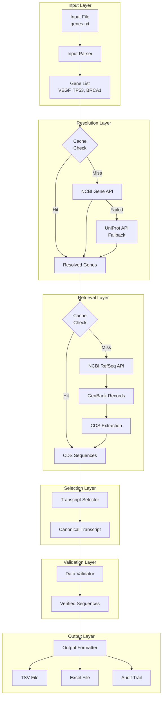

# Constitutional.seq - Visual Data Flow Diagram

## System Architecture Overview



## Detailed Component Flow

### 1️⃣ Input Processing Pipeline

```
┌─────────────┐     ┌──────────────┐     ┌─────────────┐
│  User Input │────▶│ CLI Arguments│────▶│Configuration│
└─────────────┘     └──────────────┘     └─────────────┘
                            │                     │
                            ▼                     ▼
                    ┌──────────────┐     ┌─────────────┐
                    │ Input Parser │────▶│  Gene List  │
                    └──────────────┘     └─────────────┘
                            │
                    ┌───────┴────────┐
                    ▼                ▼
              Text Files        Excel Files
              (TXT/CSV)         (XLSX/XLS)
```

### 2️⃣ Gene Resolution Flow

```
Gene Symbol: "VEGF"
        │
        ▼
┌──────────────┐
│ Cache Lookup │ ──────▶ Found? ──▶ Return Cached
└──────────────┘           │
        │                  ▼ No
        ▼
┌──────────────────────────────────┐
│     NCBI Gene Database Search     │
│  esearch.fcgi?term=VEGF[sym]      │
└──────────────────────────────────┘
        │
        ▼
┌──────────────────────────────────┐
│        Gene ID: 7422              │
│   Official Symbol: VEGFA          │
│     Confidence: 0.9               │
└──────────────────────────────────┘
        │
        ▼
    Store in Cache
```

### 3️⃣ Sequence Retrieval Pipeline

```
Gene ID: 7422
     │
     ▼
┌────────────────────────────┐
│  Search RefSeq Transcripts  │
│  "7422[Gene ID] AND refseq" │
└────────────────────────────┘
     │
     ▼
Found: 20 RefSeq IDs
     │
     ▼
┌────────────────────────────┐
│   Batch Fetch GenBank       │
│   efetch.fcgi (20 records)  │
└────────────────────────────┘
     │
     ▼
┌────────────────────────────┐
│    Parse GenBank Format     │
│    Extract CDS Features     │
└────────────────────────────┘
     │
     ▼
20 CDS Sequences Extracted
```

### 4️⃣ Transcript Selection Logic

```
                20 Transcripts
                      │
        ┌─────────────┴─────────────┐
        ▼                           ▼
   User Preference?            RefSeq Select?
        │                           │
        ├──── Yes ──▶ Select        ├──── Yes ──▶ Select
        │                           │
        ▼ No                        ▼ No
   UniProt Canonical?          Longest CDS?
        │                           │
        ├──── Yes ──▶ Select        ├──── Select
        │                           │
        ▼ No                        ▼
    Continue to Next           NM_001171623.2
                               Selected (639 bp)
```

### 5️⃣ Error Handling & Recovery

```
┌──────────────┐
│Process Batch │
└──────┬───────┘
       │
   ┌───▼────┐
   │ Error? │────▶ No ──▶ Continue
   └───┬────┘
       │ Yes
       ▼
┌──────────────────┐
│ Classify Error   │
└──────┬───────────┘
       │
   ┌───▼──────────────────────┐
   │  Network  │  API  │ Gene  │
   └───┬───────┴───┬───┴───┬───┘
       │           │       │
       ▼           ▼       ▼
   Retry w/    Rate Limit  Skip &
   Backoff      & Wait      Log
```

### 6️⃣ Caching Architecture

```
┌─────────────────────────────────────┐
│          Cache Manager              │
├─────────────────────────────────────┤
│  Namespace: "genes"                 │
│  ├── TTL: 30 days                   │
│  ├── Key: gene_VEGF                 │
│  └── Value: {id: 7422, ...}         │
├─────────────────────────────────────┤
│  Namespace: "sequences"             │
│  ├── TTL: 7 days                    │
│  ├── Key: gene_7422_sequences       │
│  └── Value: [sequences...]          │
└─────────────────────────────────────┘
```

## Data Transformation Examples

### Input → Output Transformation

```
Input File:              Processing:              Output File:
genes.txt                                        output.tsv
┌──────────┐            ┌──────────────┐        ┌────────────────────────┐
│ VEGF     │───────────▶│              │───────▶│Gene  Symbol  Accession│
│ TP53     │            │   Pipeline   │        │VEGF  VEGFA  NM_001... │
│ BRCA1    │            │              │        │TP53  TP53   NM_000... │
└──────────┘            └──────────────┘        │BRCA1 BRCA1  NM_007... │
                                                 └────────────────────────┘
```

### Parallel Processing Distribution

```
100 Genes Input
       │
   ┌───┴────────────────────────────┐
   │    Chunk into 10 batches       │
   └───┬────────────────────────────┘
       │
   ┌───▼──────────────────────────────────────────┐
   │  Thread 1  │  Thread 2  │ ... │  Thread 10  │
   │  (10 genes) │ (10 genes) │     │ (10 genes)  │
   └───┬──────────────────────────────────────────┘
       │
   ┌───▼────────────────────────────┐
   │     Aggregate Results          │
   └───┬────────────────────────────┘
       │
       ▼
   100 Results Output
```

## Performance Metrics Flow

```
Start ──▶ Process Gene ──▶ API Call ──▶ Cache Store ──▶ Next Gene
  │            │              │             │              │
  ▼            ▼              ▼             ▼              ▼
Timer      Log Entry     Rate Limit    Cache Stats    Progress
Start      Processing    Enforced      Updated        Updated
```

## Complete Processing Example: VEGF

```
Step 1: Input           "VEGF"
        ↓
Step 2: Resolution      VEGF → Gene ID: 7422, Symbol: VEGFA
        ↓
Step 3: Search          7422 → 20 RefSeq transcripts found
        ↓
Step 4: Fetch           20 GenBank records retrieved
        ↓
Step 5: Extract         20 CDS sequences extracted
        ↓
Step 6: Select          NM_001171623.2 (longest, 639 bp)
        ↓
Step 7: Validate        ✓ Complete CDS, ⚠ CTG start codon
        ↓
Step 8: Output          TSV row with sequence + metadata
```

---

*This visual representation complements the detailed data flow documentation, providing a clear understanding of how data moves through the NCBI GenBank tool pipeline.*